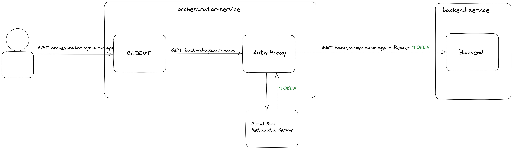

# POC Inject Service Account ID Token for Cloud Run to Cloud Run Calls

## Problem Statement

Trying to perform a lift and shift migration of an existing microservices architecture to Cloud Run by only chainging the 
target endpoints of the services without changing the code or adding Cloud Run specific authentication patterns.

We want avoid giving `allUsers` the role `roles/run.invoker` and require authentiction on all Cloud Run services.

## Proposed Solution

Create a authenticating sidecar (see(auth-sidecar)[./auth-sidecar]) that adds the Cloud Run Service's ID token as an Authorization Header on any outgoing requests to other Cloud Run services.

The approach in this repo uses an HTTP_PROXY that points to the `auth-sidecar` and requires the client service to use the target URL with an `http` scheme (yes, plain HTTP internally for now, see below for more details).



### FAQ

*Why do I have to use http in my client serivce?*

Because it's a prototype and I don't have a valid TLS certificate.

*Why do we use `HTTP_PROXY` and not `iptables`*

Cloud Run uses a sandboxed gVisor environment and gVisor doesn't allow iptables.

## Demo

Clone this repo and from within its folder run:

```sh
export PROJECT_ID=<your GCP Project ID>
export REPO_ROOT="$(pwd)"
```

### Build the Sample App and Auth Sidecar in Cloud Build

```sh
cd "$REPO_ROOT"/sample-app
gcloud builds submit . --project $PROJECT_ID
```

```sh
cd "$REPO_ROOT"/auth-sidecar
gcloud builds submit . --project $PROJECT_ID
```

### Deploy a Backend Service

```sh
gcloud run deploy backend-service --image europe-west1-docker.pkg.dev/$PROJECT_ID/demo-repo/sample-app --region europe-west1 --no-allow-unauthenticated --project $PROJECT_ID
```

validate the backend service runs

```sh
curl "$(gcloud run services describe backend-service --region=europe-west1 --project=$PROJECT_ID --format="value(status.url)")/test" -H "Authorization: Bearer $(gcloud auth print-identity-token)"
```

This should return

```txt
hello from the downstream app
```

### Magic Moment: Deploy the Orchestrator Service with Sidecar Proxy

```sh

cat <<EOF > orchestrator-service.yaml
apiVersion: serving.knative.dev/v1
kind: Service
metadata:
  name: orchestrator-service
  labels:
    cloud.googleapis.com/location: "europe-west1"
spec:
  template:
    metadata:
      annotations:
        run.googleapis.com/container-dependencies: '{"sample-app":["auth-sidecar"]}'
    spec:
      containers:
        - name: sample-app
          image: "europe-west1-docker.pkg.dev/$PROJECT_ID/demo-repo/sample-app:latest"
          ports:
            - containerPort: 8080
          env:
            - name: HTTP_PROXY
              value: "http://127.0.0.1:8000"
            - name: TARGET_URL
              value: "$(gcloud run services describe backend-service --region=europe-west1 --project=$PROJECT_ID --format="value(status.url)" | awk '{gsub("https", "http"); print}')/test"
        - name: auth-sidecar
          image: "europe-west1-docker.pkg.dev/$PROJECT_ID/demo-repo/auth-sidecar:latest"
          startupProbe:
            timeoutSeconds: 240
            periodSeconds: 240
            failureThreshold: 1
            tcpSocket:
              port: 8080

EOF

gcloud run services replace orchestrator-service.yaml --project $PROJECT_ID
```

try it out: 

```sh
curl "$(gcloud run services describe orchestrator-service --region=europe-west1 --project=$PROJECT_ID --format="value(status.url)")/test" -H "Authorization: Bearer $(gcloud auth print-identity-token)"
```

this should return:

```txt
response from http://<BACKEND-SERVICE-URL>.a.run.app/test: hello from the downstream app
```